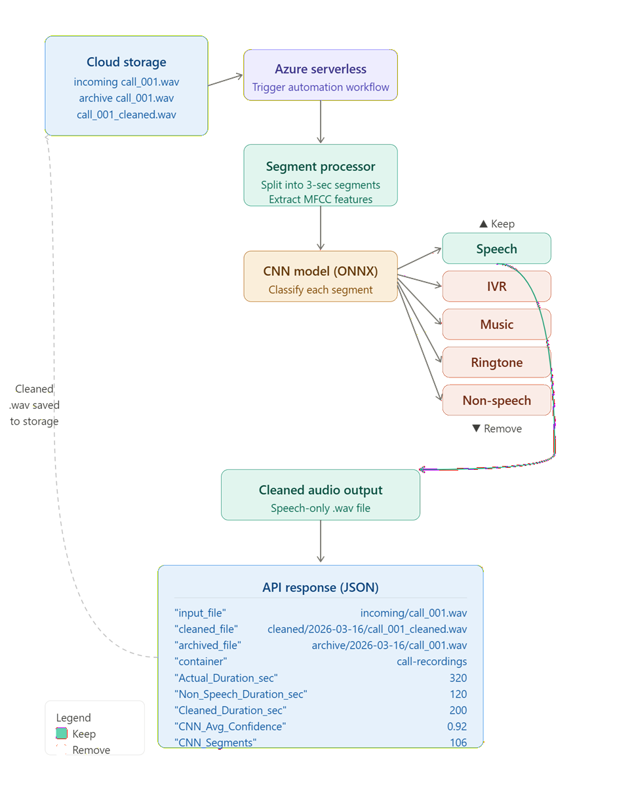

# Call Recording Cleaner API

**AI-powered audio preprocessing engine** designed to automatically remove **non-conversational audio segments** such as **IVR prompts, ringing tones, music, silence, and background noise** from support call recordings.

The system uses a **CNN-based audio classification model deployed with ONNX Runtime** to isolate the **actual customer–agent conversation** from raw call recordings.

The cleaned recordings are then used for downstream **speech analytics, transcription, and AI-driven call intelligence analysis**.

---

## 📑 Index

- [Overview](#overview)
- [Problem Statement](#problem-statement)
- [Benefits](#benefits)
- [Solution Architecture](#solution-architecture)
- [AI Audio Classification Model](#ai-audio-classification-model)
- [Processing Pipeline](#processing-pipeline)
- [Output Metadata](#output-metadata)
- [API Request Example](#api-request-example)
- [Technology Stack](#technology-stack)
- [Folder Structure](#folder-structure)
- [Run Locally](#run-locally)
- [Deploy to Azure Functions](#deploy-to-azure-functions)
- [Execute API from Postman](#execute-api-from-postman)
- [API Response Output](#api-response-output)
- [Integration in AI Call Intelligence Platforms](#integration-in-ai-call-intelligence-platforms)
- [Future Enhancements](#future-enhancements)
- [License](#license)

---

# Overview

**Call Recording Cleaner API** is a **serverless audio preprocessing service** that improves the quality of **enterprise support call recordings** before they are analyzed by AI systems.

Customer support recordings often contain large portions of **non-conversational audio**, including:

- **IVR menu prompts**
- **Ringing tones**
- **Hold music**
- **Silence**
- **Background noise**

These segments significantly reduce the accuracy of **speech recognition** and **conversation analytics systems**.

This service automatically identifies and removes these segments using a **machine learning audio classifier**, leaving only the **actual agent–customer conversation**.

The cleaned recordings significantly improve the performance of:

- **Speech-to-Text engines**
- **Conversation analytics models**
- **Sentiment analysis systems**
- **Call quality intelligence platforms**

---

# Problem Statement

Modern **enterprise support environments** generate **thousands of recorded calls every day**.

However, these recordings contain significant portions of **irrelevant audio segments**, including **IVR navigation, ringing tones, hold music, and silence**. These segments negatively impact downstream **AI systems used for speech transcription and call intelligence analysis**.

**Speech-to-Text engines** often attempt to transcribe these **non-speech segments**, leading to:

- **Inaccurate transcripts**
- **Noise in conversation analysis**
- **Poor sentiment detection**
- **Misleading AI insights**

Manual audio cleaning is **not scalable** and cannot support **large enterprise call volumes**.

An **automated preprocessing pipeline** is required to isolate the **actual conversation segments** before recordings are analyzed by AI systems.

The **AI Call Recording Cleaner API** solves this problem by applying **machine learning-based audio classification** to detect and remove **non-speech segments automatically**.

---

# Benefits

## Improved Speech Recognition Accuracy

By removing **IVR prompts, music, ringing tones, and silence**, the system significantly improves **transcription accuracy** for **Speech-to-Text engines**.

---

## Faster AI Processing

Reducing the **overall audio length** decreases processing time for **speech transcription** and **AI analytics pipelines**.

---

## Higher Quality Conversation Analytics

AI models performing **sentiment analysis, compliance monitoring, and operational insights generation** work more accurately when only **relevant conversation audio** is analyzed.

---

## Scalable Processing

The **serverless architecture** enables **automated processing of large volumes of call recordings** without manual intervention.

---

## Automated Audio Intelligence

The **CNN-based audio classifier** automatically detects and categorizes **speech vs non-speech segments** without relying on **rule-based logic**.

---

## Reusable Microservice Component

The **AI Call Recording Cleaner API** is designed as a **reusable microservice component** that can be integrated into **multiple AI and enterprise automation pipelines**.

Because the service is exposed as a **lightweight API**, it can be reused across:

- **Call intelligence platforms**
- **Speech analytics systems**
- **Customer experience analytics solutions**
- **Contact center automation workflows**
- **AI-driven service desk platforms**

This **modular microservice architecture** allows organizations to plug the audio cleaning capability into **any speech processing pipeline** without modifying downstream systems.

As a result:

- AI platforms can **standardize audio preprocessing**
- Development teams can **reuse the same service across multiple applications**
- Enterprises can maintain **consistent audio quality across analytics systems**

---

## Lightweight Serverless API (Zero Infrastructure Management)

The audio cleaning model runs inside an **Azure Function serverless environment**, meaning:

- **No dedicated servers are required**
- **No infrastructure management is needed**
- The function **scales automatically**
- Costs are incurred **only when the function executes**

Because the model is packaged using **ONNX Runtime and Python**, the API remains **lightweight and efficient**, allowing recordings to be processed **without requiring GPU infrastructure**.

This makes the service ideal for **enterprise automation pipelines where cost efficiency and scalability are critical**.

---

# Solution Architecture

The following diagram illustrates the architecture of the **Call Recording Cleaner API** within an AI-driven call intelligence platform.

[](architecture/solution-architecture.png)

### Processing Flow

1. Raw call recordings are stored in a **cloud storage container**
2. An **automation workflow** triggers the **audio cleaning API**
3. The recording is downloaded for processing
4. The audio is split into **fixed-length segments**
5. A **CNN audio classification model** analyzes each segment
6. **Non-speech segments are removed**
7. Cleaned **conversation audio is reconstructed**
8. The cleaned recording is uploaded to **cloud storage**
9. The original recording is **archived**
10. **Processing metadata** is returned

---

# AI Audio Classification Model

The system uses a **CNN-based audio classifier exported to ONNX format**.

The model classifies audio segments into the following categories:

- **Speech**
- **IVR**
- **Music**
- **Ringtone**
- **Non-Speech**

Only **speech segments** are preserved in the cleaned output.

Audio features are extracted using **MFCC (Mel-Frequency Cepstral Coefficients)** before classification.

---

# Processing Pipeline

1. Audio file is downloaded from **Azure Blob Storage**
2. Recording is segmented into **3-second windows**
3. **MFCC features** are extracted from each segment
4. **ONNX Runtime** performs **CNN inference**
5. Each segment is classified into **audio categories**
6. **Non-speech segments are removed**
7. **Speech segments are concatenated**
8. Cleaned audio file is generated
9. Cleaned recording is uploaded to **cloud storage**
10. Original recording is archived

---
# Output Metadata

The service generates **processing metadata** for each recording.

Example output:

```json
{
  "Recording_File_Name": "call_123.wav",
  "Actual_Duration_sec": 320,
  "Non_Speech_Duration_sec": 120,
  "Cleaned_Duration_sec": 200,
  "CNN_Avg_Confidence": 0.93,
  "CNN_Segments": 106
}
```

---

# API Request Example

## POST Request

```json
{
  "STORAGE_ACCOUNT": "mystorageaccount",
  "CONTAINER": "call-recordings",
  "INPUT_FILE": "incoming/call_123.wav",
  "CLEANED_RECORDINGS": "cleaned",
  "ARCHIVED_RECORDINGS": "archive"
}
```

---

## Technology Stack

### AI & Machine Learning
- **CNN Audio Classification Model**
- **ONNX Runtime**
- **MFCC Audio Feature Extraction**

### Cloud Platform
- **Azure Functions**
- **Azure Blob Storage**
- **Managed Identity Authentication**

### Processing
- **Python**
- **Librosa** (audio processing)
- **NumPy**
- **SoundFile**

### Automation
- **Power Automate**
- **Serverless Event Processing**

---

## Folder Structure

```
CALL-RECORDING-CLEANER-API
│
├── CallRecordingCleaner
│   ├── __init__.py
│   └── function.json
│
├── cleaner
│   ├── cleaner.py
│   ├── audio_classifier.onnx
│   └── audio_classifier.onnx.data
│
├── requirements.txt
├── host.json
├── local.settings.json
├── LICENSE
├── MODEL_LICENSE.md
└── README.md

```

---

## Run Locally

### Install Azure Functions Core Tools

```bash
npm install -g azure-functions-core-tools@4 --unsafe-perm true
```

### Install Python Dependencies

```bash
pip install -r requirements.txt
```

### Start Local Function

```bash
func start
```

### Local Endpoint

```
http://localhost:7071/api/CallRecordingCleaner
```

---

## Deploy to Azure Functions

### Login to Azure

```bash
az login
```

### Create Function App

```bash
az functionapp create \
--resource-group myResourceGroup \
--consumption-plan-location eastus \
--runtime python \
--runtime-version 3.10 \
--functions-version 4 \
--name ai-call-recording-cleaner \
--storage-account mystorageaccount \
--os-type linux
```

### Deploy Function

```bash
func azure functionapp publish ai-call-recording-cleaner
```

### API Endpoint

```
https://ai-call-recording-cleaner.azurewebsites.net/api/CallRecordingCleaner
```

---

## Execute API from Postman

### Method

```
POST
```

### URL

```
https://<function-app-name>.azurewebsites.net/api/CallRecordingCleaner
```

### Headers

```
Content-Type: application/json
```

### Body

```json
{
  "STORAGE_ACCOUNT": "mystorageaccount",
  "CONTAINER": "call-recordings",
  "INPUT_FILE": "incoming/call_001.wav",
  "CLEANED_RECORDINGS": "cleaned",
  "ARCHIVED_RECORDINGS": "archive"
}
```

---

## API Response Output

The API returns **metadata about the processed recording**.

### Example Response

```json
{
  "input_file": "incoming/call_001.wav",
  "cleaned_file": "cleaned/2026-03-16/call_001_cleaned.wav",
  "archived_file": "archive/2026-03-16/call_001.wav",
  "container": "call-recordings",
  "Recording_File_Name": "call_001.wav",
  "Actual_Duration_sec": 320,
  "Non_Speech_Duration_sec": 120,
  "Cleaned_Duration_sec": 200,
  "CNN_Avg_Confidence": 0.92,
  "CNN_Segments": 106
}
```

---

## Integration in AI Call Intelligence Platforms

This service is typically used as the **first stage in an AI call analytics pipeline**.

### Example Pipeline

1. **Call Recording Ingestion**
2. **Audio Cleaning (AI Call Recording Cleaner API)**
3. **Speech-to-Text Transcription**
4. **AI Conversation Analysis**
5. **Call Quality Scoring**
6. **Operational Intelligence Metrics**
7. **Analytics Dashboards (Power BI)**

---

## Future Enhancements

Potential future improvements include:

- **Speaker separation (agent vs customer)**
- **Silence detection optimization**
- **Real-time streaming audio cleaning**
- **GPU-accelerated inference**
- **Advanced noise reduction**
- **Automatic call segmentation**

---

## License

The **source code** in this repository is licensed under the **MIT License**.

See the `LICENSE` file for details.

### Model License

The **AI audio classification model** included in this repository is licensed separately.

Model files:

- `audio_classifier.onnx`
- `audio_classifier.onnx.data`

These are provided for **research and evaluation purposes only**.

See `MODEL_LICENSE.md` for details.

